# Line detection on cuneiform tablet photographs and the hand-off to ProtoSnap

This document describes the pipeline in `line_cropping/` for a reader who knows OCR and object detection but not cuneiform or this project. Standard vision terms are used without explanation; terms specific to Assyriology or to this repository are defined where they first appear. Commands and per-phase numbers are in `line_cropping/README.md`; the design rationale and its revisions are in `docs/line_cropping_plan.md`.

## 1. Task

Cuneiform is the wedge-impressed script of ancient Mesopotamia. A **tablet** is a clay document written on several **faces**: the **obverse** (front), the **reverse** (back), and up to four narrow edges. Text runs in horizontal **lines**, occasionally in several **columns** per face. The task is line segmentation on museum photographs: for each face, produce one crop per line of writing, in reading order, each crop containing its own line and no part of the lines above or below. The crops are the intended input to **ProtoSnap**, this repository's method for aligning a font-derived sign prototype to a photographed sign (section 8).

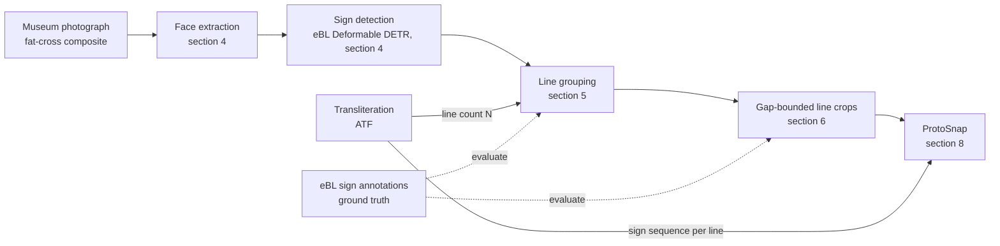

## 2. Data

**Photographs.** Museums publish a composite image per tablet in the **fat-cross** layout: obverse at the centre, reverse below, the four edges around them (Figure 1). Composites are typically 2,000 to 5,000 pixels on a side against a black studio background; a minority (Iraq Museum, some Penn Museum photographs) use a light background. Line height ranges from about 60 to 300 pixels, median 121.

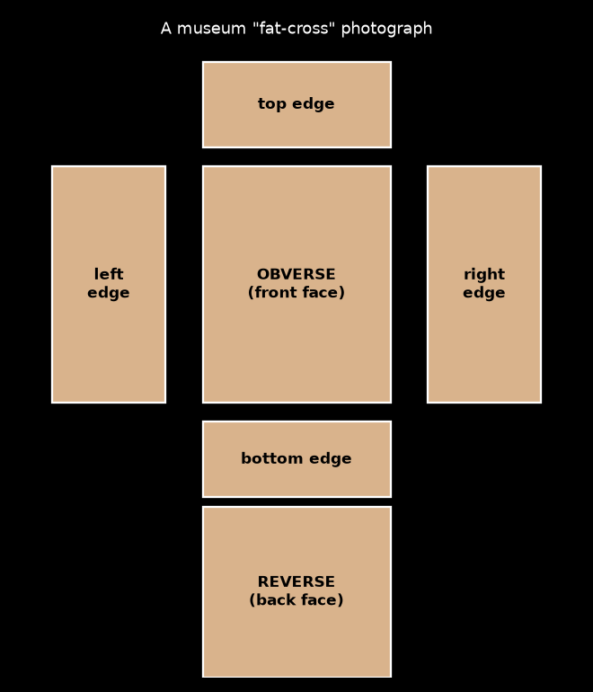

*Figure 1. The fat-cross composite. The pipeline processes the obverse and reverse, and an edge only when the transliteration says it carries text.*

**Transliterations.** A **transliteration** is a scholar's sign-by-sign rendering of the text in Latin script, one text line per line, in the plain-text **ATF** format (ASCII Transliteration Format). Structure lines start with `@` (`@obverse`, `@reverse`, `@column 1`), state lines with `$` (`$ beginning broken`), text lines with a number. A **prime** on a line number (`1'.`) means the count is relative because the beginning is lost. Two sources are used: **CDLI** (Cuneiform Digital Library Initiative), whose catalogue identifies tablets by **P-number** (`P393787`), and **eBL** (Electronic Babylonian Library), which identifies them by **museum number** (`K.4426`, `YBC.4644`). The two are joined on the museum number, which CDLI stores partly in a separate accession-number field.

**Sign annotations.** eBL's public API returns, per tablet, the composite photograph and every sign box drawn by its annotators: geometry in percent of the image, sign name, and a **path** whose first element indexes the text line in eBL's own ATF. About 2,000 tablets are annotated (the sign-crop release of this data is Lewenstein et al. 2026 [4]); this project pulled all 873 that are Neo-Assyrian (**NA**) or Old Babylonian (**OB**) in script, 47,432 boxes in total. Annotation is partial: the annotated lines cover a median of 86 percent of a tablet's transliterated lines, more for OB than NA. These boxes are the only ground truth in the project, so every metric below is conditioned on **coverage**, the ratio of annotated lines to transliterated lines on a face.

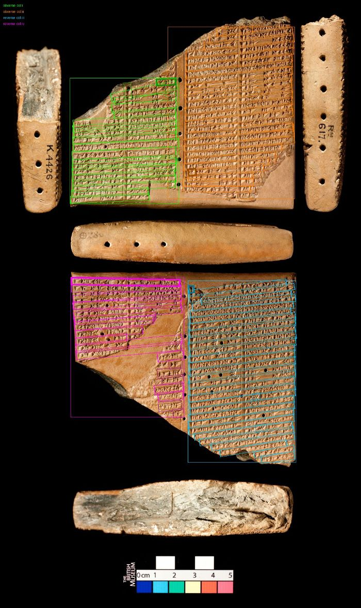

*Figure 2. eBL sign boxes on K.4426, grouped by text-line index into per-column blocks; the thick box marks each block's first annotated line.*

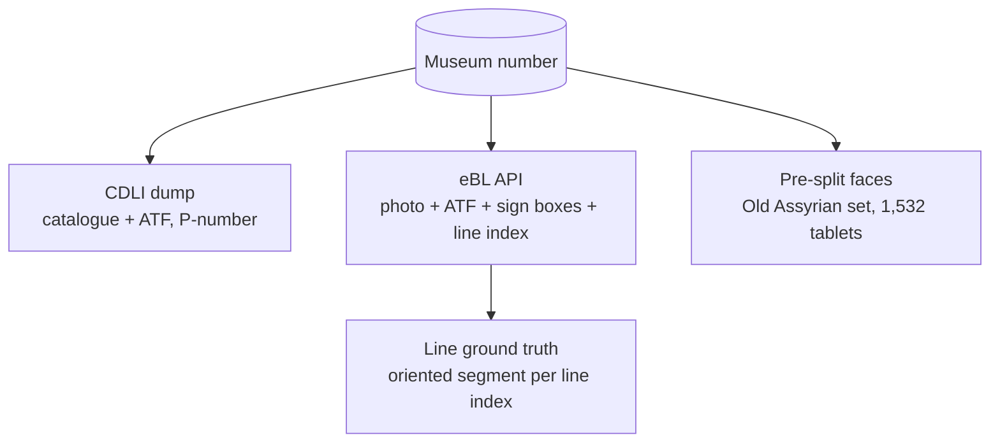

A second corpus, 1,532 **Old Assyrian** (**OA**, c. 1950 to 1850 BC) tablets supplied as pre-split face images at about 45 pixels per line, was worked on first and is now parked; it is mentioned in section 7 because it inverts the conclusions.

## 3. Line ground truth from sign boxes

Sign boxes are grouped into lines by (face, object, column, text-line index). Face and column come from the eBL crop label (`ii o 6'` = column ii, obverse, line 6'), else from the eBL surface boxes, else from mapping the path index back into eBL's ATF, whose `@` structure lines occupy indices in the same sequence; that mapping is validated against labelled signs and dropped below 90 percent agreement, which happens when an edition was edited after annotation. Each line is stored as an **oriented segment**: the least-squares centre line through the sign centres, spanning the annotated extent, with a thickness of 1.15 times the median sign height. Oriented segments matter because 56 percent of lines tilt by more than 3 degrees in the photograph and axis-aligned boxes of neighbouring lines overlapped in 69 percent of cases.

## 4. Face extraction and sign detection

**Face extraction.** Faces are segmented from the composite by thresholding against the background (polarity chosen from the border median), light morphological closing, connected components, and splitting of touching components at near-empty runs of the column and row profiles. Each side takes the union of every component that holds a share of its ground-truth lines, so a face broken into several fragments stays one crop. Sides with no annotations cannot be identified and are skipped.

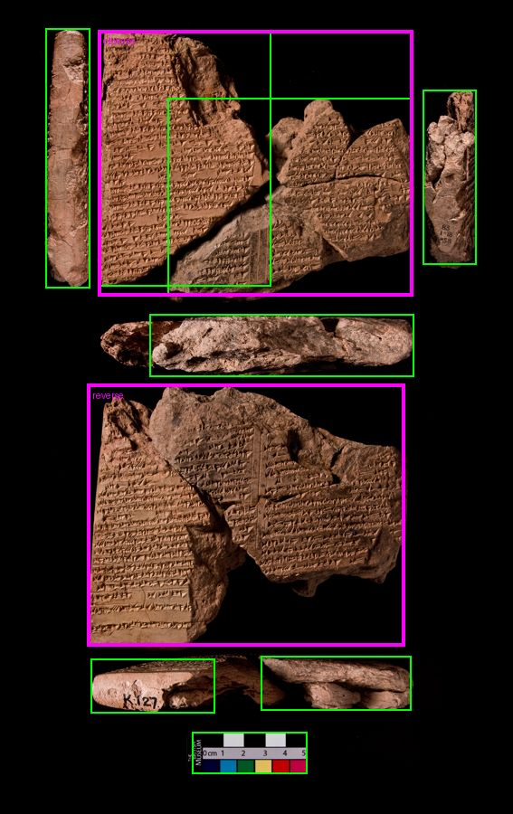

*Figure 3. K.127: bright components (green) and the obverse and reverse regions chosen from them (magenta).*

**Sign detection.** The detector is eBL's **Deformable DETR** (ResNet-50 backbone, 173 sign classes), trained on 124,504 annotated signs as described in Che et al. 2026 [1] and released with weights on Zenodo [2] (CC BY 4.0); it succeeds the FCENet-based detector of Cobanoglu et al. 2024 [3]. It runs in a separate mmdetection environment at about six faces per second on an RTX 4060, with inputs rescaled to fit 1333 by 800. Detections are kept at score 0.3 or above. On eBL faces it returns a median of 51 boxes per face.

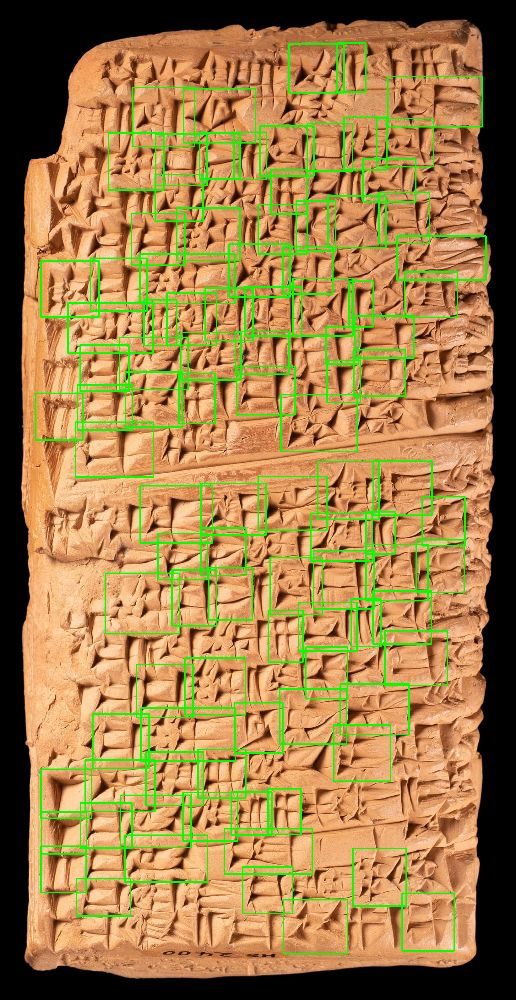

*Figure 4. Deformable DETR boxes on the obverse of HS.2400.*

## 5. Line grouping

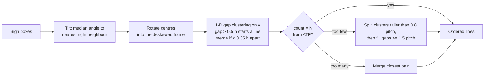

Tilt is the median angle between each box centre and its nearest neighbour to the right within one box height; centres are rotated about the face centre by that angle. Lines are then formed by sorting centre heights and cutting at gaps larger than 0.5 times the median box height, followed by merging clusters closer than 0.35 box heights. The thresholds were chosen by grid search on a tune split and are stored in `ebl_tablets/det_params.json`.

When a transliteration exists, its line count for that side, **N**, is enforced (`det_n` in the code): over-merged clusters are split first, then lines are interpolated into gaps of at least 1.5 pitches, then surplus lines are merged. **Pitch** here is the median centre-to-centre distance between consecutive lines on the face, and all tolerances below are expressed in pitches. Without a transliteration the clustering output stands (`det`).

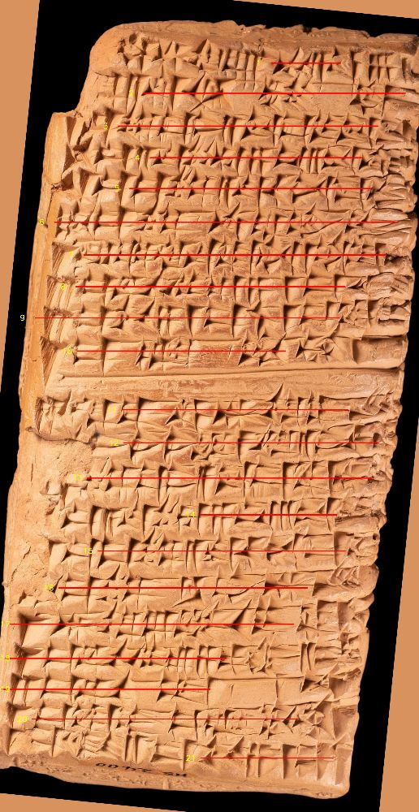

*Figure 5. Line centres (red) derived from the boxes in Figure 4, numbered from the top.*

The projection-profile alternative was built and evaluated first: deskew by maximising row-profile variance, then place N lines by rigid comb or by a chain dynamic programme with a gap prior. It plateaus at 0.62 recall on eBL faces, and 0.65 even with oracle tilt, count and extent, because the vertical-gradient profile is only weakly in phase with the line bands and pitch errors accumulate down the face (Figure 6). It is retained as `dp` for the OA case in section 7.

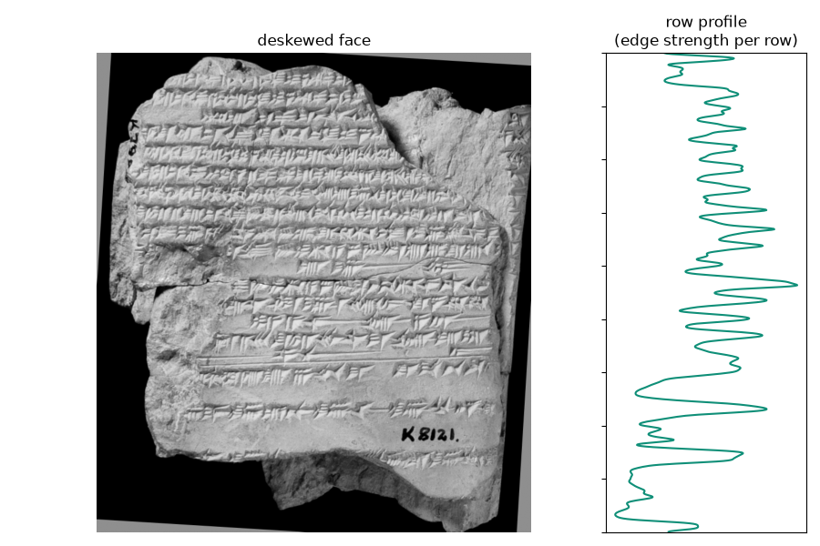

*Figure 6. A deskewed face and its row profile of vertical-gradient magnitude; the profile tracks the lines loosely but its peaks are not reliably centred on them.*

## 6. Gap-bounded crops

The crop for a line is bounded vertically by the gaps to its neighbours, not by a fixed band. Each line's extent is the 10th to 90th percentile of the tops and bottoms of the boxes assigned to it in the deskewed frame; the boundary between two lines is the midpoint of the gap between one's bottom and the next's top, or the midpoint of the two centres when their boxes overlap. First and last lines get 6 percent of a pitch of margin. Horizontally the crop spans the line's boxes plus half a pitch each side. Crops are written per face with a CSV giving the rectangle in the deskewed face, the deskew angle, the face's offset in the composite, and the ATF line label when the predicted count equals N for a single-column side.

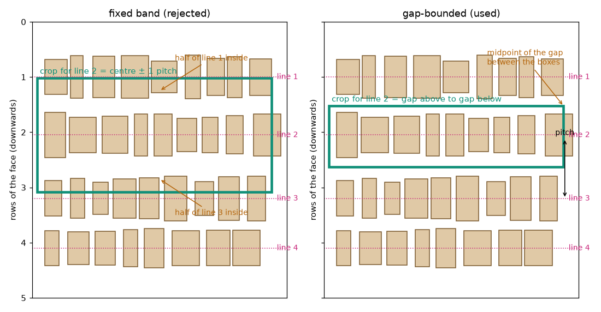

*Figure 7. A band tall enough for line 2 also contains half of lines 1 and 3; the gap-bounded crop does not.*

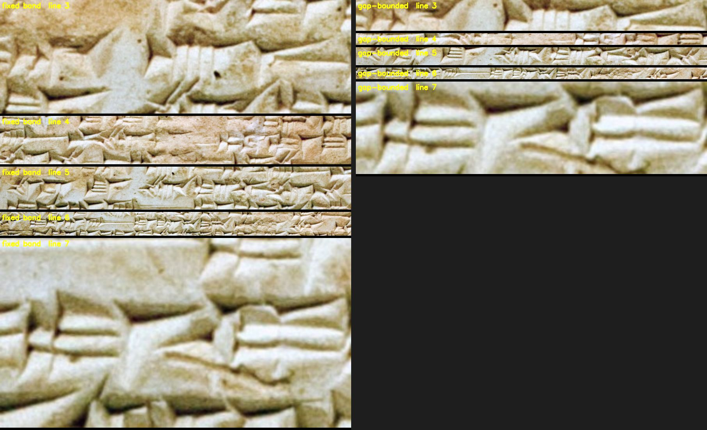

*Figure 8. Five consecutive lines of BM.141781 as fixed two-pitch bands (left) and gap-bounded crops (right).*

The fixed band was the first implementation and was rejected on review: eBL sign boxes are about as tall as the pitch (median band 191 px against a 137 px pitch), so any band that contains a whole annotated band also contains parts of its neighbours; 30 percent of band crops held the centre of a second line.

## 7. Evaluation

A line is matched when its predicted centre lies within 0.35 pitch of a ground-truth centre in the deskewed frame. Precision is reported only on faces with coverage of at least 0.9, since an unannotated line would otherwise count as a false positive. First-line error is reported only where the topmost annotated line is line 1 or 1'. The 1,334 single-column eBL faces with detections were split in half, stratified by script and pixels-per-line bucket; thresholds were tuned on one half and all numbers below come from the other.

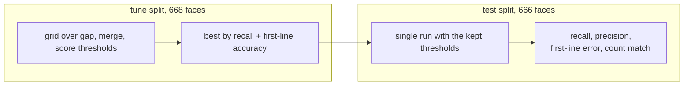

| test split, `det_n` | faces | recall | precision | first line within 0.5 pitch | count = N |
| --- | --- | --- | --- | --- | --- |
| all scored | 487 | 0.91 | 0.91 | 90% | 85% |
| OB, 120+ px per line | 229 | 0.90 | 0.91 | 93% | 99% |
| NA, 60 to 120 px per line | 114 | 0.94 | 0.93 | 78% | 54% |
| NA, under 60 px per line | 26 | 0.82 | 0.63 | 57% | 54% |

Without N (`det`): recall 0.87, precision 0.90, first line within 0.5 pitch on 88 percent. The plan's targets for faces with at least 120 pixels per line were recall 0.90, first-line accuracy 90 percent and count agreement 80 percent; the test split gives 0.90, 92 percent and 97 percent. On the crops, 99 percent of annotated line centres fall inside exactly one crop, 0 percent inside two, and 2 percent of crops contain the centre of a second line.

Known weaknesses: NA transliterations frequently count lines the photograph does not show, so count agreement is near 50 percent there even though line recall stays above 0.9; the 33 multi-column faces are excluded; lines that curve within a face are still cut as horizontal strips.

**The Old Assyrian set reverses the ranking.** On those pre-split faces the detector returns a median of 22 boxes per face and its unaided count matches N on only 18 percent of faces; the profile dynamic programme with N finds 0.89 of 785 hand-labelled lines against 0.43 for the detector route, and 0.78 against 0.33 on the subset of lines the labeller moved by hand. The labels also showed that N is an upper bound rather than the visible line count on half of those faces. The 90 labelled faces were produced with a click-to-mark web page built for the purpose; the set is parked pending a count-selection method.

## 8. ProtoSnap

ProtoSnap [5] takes a single-sign image and a **prototype**, a glyph rendered from a cuneiform font, with a **skeleton**, a hand-annotated stroke graph over the glyph recording each wedge. It initialises an affine placement of the skeleton from mutual nearest neighbours in **DIFT** features (diffusion-model features in the sense of Tang et al. 2023 [7], taken from a Stable Diffusion checkpoint fine-tuned on cuneiform and prompted with the sign name), then optimises a global transform plus per-stroke transforms against a feature-similarity loss. The transliteration-to-image alignment idea follows Dencker et al. 2020 [6]. The repository ships prototypes and skeletons for three fonts: Santakku (OB), Assurbanipal (NA) and Esagil (Neo-Babylonian); there is no OA font.

The gap-bounded crops are the intended input: the transliteration line gives the ordered sign sequence, the deskew angle gives the prototype rotation, and the pitch gives the expected sign height. As a first trial the connection was taken one step further to single signs. For each crop, the ATF line is tokenised into sign names (values mapped to signs with a frequency table built from eBL's sign metadata), the detector boxes inside the crop are ordered left to right, and the two sequences are aligned by Needleman-Wunsch (+2 same sign name, 0 different, -1 gap). Each matched box with a Santakku prototype becomes a target. On the first 400 OB crops: 58 percent of ATF signs matched a box, and where the eBL truth box of that sign exists, the matched box overlaps it at IoU above 0.5 in 70 percent of cases. Restricting to the 882 targets where the detector's class equals the ATF sign, a 40-target run completed without error; the initialisation score, ProtoSnap's own agreement measure, has a median of 0.60 against 0.75 on the repository's curated single-sign test set, and about half the alignments are visually correct (Figure 9). Twenty-eight of the 40 boxes coincide with the eBL truth box and none contradicts it, so the residual is in the sign images themselves, chiefly the 15 percent padding that admits neighbouring wedges and low-relief signs.

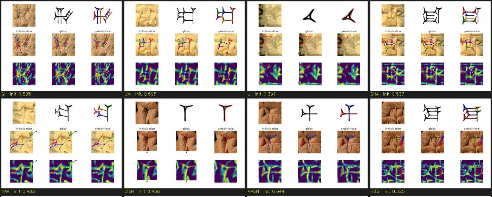

*Figure 9. Eight of the 40 trial results: target, prototype, and skeleton after global and per-stroke alignment, over the photograph and over the DIFT similarity map.*

This sign-level trial exceeded the project's stated aim, which is the clean line crop; it is kept because the sign-to-box alignment is what a per-line ProtoSnap run needs.

**Projecting results back onto the tablet.** `overlay_results.py` maps each fitted skeleton out of ProtoSnap's 512-pixel target frame, undoing the y flip it saves with, through the padded sign box into face pixels, and then through the face's deskew rotation into the line crop's coordinates. This yields two views per result: the unrotated face with every fitted skeleton and its source box drawn (Figure 10), and the gap-bounded line crop with the skeletons of its signs drawn in place (Figure 11). The line view is the one that shows what the pipeline was built for: a single-line crop, the sign box the detector put inside it, and ProtoSnap's stroke graph snapped onto the wedges within that box. Outputs are in `output/phase6_OB/overlays/` with an `index.csv` linking each target to its two overlays.

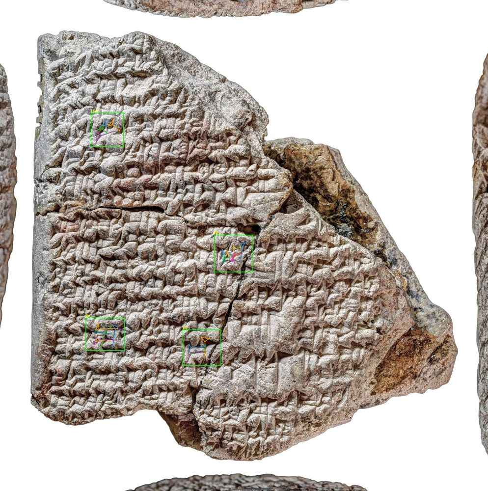

*Figure 10. Fitted skeletons of the trial's targets drawn on the reverse of CBS.1601, each with the detector box it came from.*

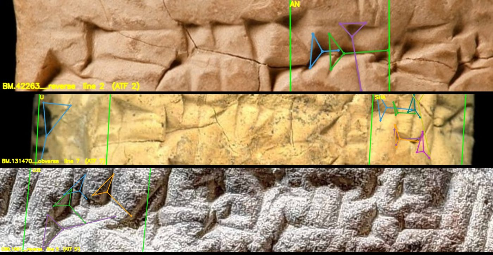

*Figure 11. The same kind of result on single-line crops: BM.42263 reverse line 2, BM.131470 obverse line 7, CBS.1601 reverse line 5. Green is the sign box; coloured strokes are the fitted skeleton, one colour per stroke.*

## 9. Running the pipeline

All commands run from the repository root; the detector runs in the mmdetection environment at `~/venvs/mmdet`.

```
python -m line_cropping.ingest.download_ebl
python -m line_cropping.truth.ebl_ground_truth
python -m line_cropping.faces.prepare_faces ebl
~/venvs/mmdet/bin/python -m line_cropping.lines.detect_signs --faces ebl_tablets/faces/faces.csv --out ebl_tablets/detections --single-column-only
python -m line_cropping.lines.lines_from_boxes --faces ebl_tablets/faces/faces.csv --det ebl_tablets/detections --out ebl_tablets/predictions --use-n
python -m line_cropping.crops.make_crops --faces ebl_tablets/faces/faces.csv --pred ebl_tablets/predictions --method det_n --out ebl_tablets/line_crops
python -m line_cropping.eval.phase5_eval
python -m line_cropping.eval.evaluate_crops --faces ebl_tablets/faces/faces.csv --crops ebl_tablets/line_crops/crops.csv
python -m line_cropping.protosnap.protosnap_prep --script OB --font Santakku --out protosnap_inputs/OB
```

Outputs land under `ebl_tablets/`: `faces/` (face crops and line truth in face coordinates), `detections/`, `predictions/<method>/`, `line_crops/<face>/` with `crops.csv`, `split.csv`, `det_params.json`, `phase5_test_results.csv`.

## 10. Sources

1. Wentao Che et al., *Automated sign detection across the Electronic Babylonian Library: a large-scale dataset and end-to-end cuneiform OCR pipeline*, 2026. <https://arxiv.org/abs/2606.22608>
2. eBL, *Sign Detection for Cuneiform Tablets: trained models* (Deformable DETR weights, 173 and 106 classes), Zenodo, 2025. <https://zenodo.org/records/17395154> — inference code: <https://github.com/ElectronicBabylonianLiterature/cuneiform-ocr>
3. Yunus Cobanoglu, Luis Sáenz, Ilya Khait, Enrique Jiménez, *Sign detection for cuneiform tablets*, it - Information Technology, 2024. <https://doi.org/10.1515/itit-2024-0028> — data and models: <https://zenodo.org/records/10693601>
4. Or Lewenstein et al., *A Large-Scale Dataset of Annotated Cuneiform Sign Images for Digital Palaeography*, Journal of Open Humanities Data, 2026. <https://doi.org/10.5334/johd.503> — data: <https://zenodo.org/records/17949595>
5. Rachel Mikulinsky, Morris Alper, Shai Gordin, Enrique Jiménez, Yoram Cohen, Hadar Averbuch-Elor, *ProtoSnap: Prototype Alignment for Cuneiform Signs*, ICLR 2025. <https://arxiv.org/abs/2502.00129>
6. Tobias Dencker, Pablo Klinkisch, Stefan M. Maul, Björn Ommer, *Deep learning of cuneiform sign detection with weak supervision using transliteration alignment*, PLOS ONE, 2020. <https://doi.org/10.1371/journal.pone.0243039>
7. Luming Tang et al., *Emergent Correspondence from Image Diffusion* (DIFT), NeurIPS 2023. <https://arxiv.org/abs/2306.03881>
8. Xizhou Zhu et al., *Deformable DETR: Deformable Transformers for End-to-End Object Detection*, ICLR 2021. <https://arxiv.org/abs/2010.04159>
9. Electronic Babylonian Library API (photographs, annotations, transliterations): <https://www.ebl.lmu.de/> — Cuneiform Digital Library Initiative: <https://cdli.mpiwg-berlin.mpg.de/>
